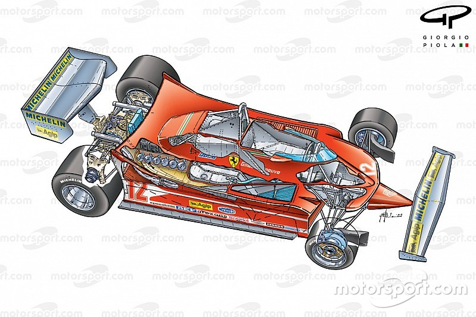
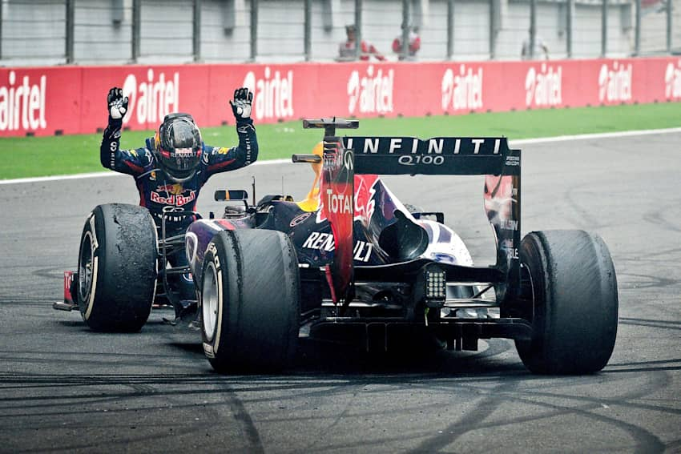

# História da Fórmula 1

A Fórmula 1 (F1) é a mais alta categoria do automobilismo internacional de monolugares. Desde a sua criação em 1950, combina velocidade extrema, tecnologia avançada e talento humano, tornando-se um dos desportos mais populares e prestigiados do mundo.

---

## Origens da Fórmula 1 (Antes de 1950) 

Antes de a Fórmula 1 existir oficialmente, o automobilismo era praticado sobretudo através de corridas de Grandes Prémios na Europa, muitas vezes disputadas em estradas públicas e com poucas medidas de segurança. Após o fim da Segunda Guerra Mundial, a Federação Internacional do Automóvel (FIA) decidiu criar um conjunto de regras unificado que permitisse a realização de um campeonato mundial organizado.

---

## Nascimento do Campeonato do Mundo (1950)

O Campeonato do Mundo de Fórmula 1 teve início em 1950, com a realização do primeiro Grande Prémio da história em Silverstone, no Reino Unido. Nessa primeira temporada, os carros ainda utilizavam motores dianteiros e apresentavam níveis de segurança muito reduzidos. Giuseppe Farina tornou-se o primeiro Campeão do Mundo, ao volante de um Alfa Romeo.

---

## Evolução Tecnológica (décadas de 1960–1970)

Durante a década de 1960, a Fórmula 1 entrou numa fase de grande inovação tecnológica, marcada pela mudança dos motores para a parte traseira dos carros e por importantes avanços na aerodinâmica. Equipas como a Lotus e a Ferrari destacaram-se nesta época. Já na década de 1970, surgiram as asas aerodinâmicas e começaram a ser implementadas medidas mais sérias de segurança, numa altura em que pilotos como Jackie Stewart e Niki Lauda ganharam grande notoriedade.

---

## Era Turbo e Rivalidades (década de 1980)

Nos anos 1980, a Fórmula 1 ficou marcada pela introdução dos motores turbo, que proporcionavam níveis de potência nunca antes vistos. Esta década assistiu também a um crescimento significativo da popularidade do desporto e a rivalidades intensas entre pilotos, destacando-se a histórica disputa entre Ayrton Senna e Alain Prost. Equipas como a McLaren e a Williams dominaram grande parte deste período.

---

## Expansão Global e Segurança (década de 1990)

Na década de 1990, a Fórmula 1 expandiu-se para novos continentes, reforçando o seu estatuto de desporto global. Ao mesmo tempo, registaram-se grandes progressos ao nível da segurança, especialmente após a trágica morte de Ayrton Senna em 1994, que marcou profundamente a modalidade. Foi também nesta década que Michael Schumacher começou a afirmar-se como uma das maiores figuras da história da Fórmula 1.

---

## Domínio da Ferrari (2000–2004)

No início dos anos 2000, a Fórmula 1 foi dominada pela parceria entre Michael Schumacher e a Ferrari. Durante este período, Schumacher conquistou cinco campeonatos do mundo consecutivos, enquanto a Ferrari atingiu um nível de excelência técnica e estratégica raramente visto, tornando-se a equipa de referência da época.

---

## Novos Campeões (2005–2013)

A partir de 2005, a Fórmula 1 passou por várias alterações regulamentares com o objetivo de equilibrar a competição. Este período foi marcado pelo surgimento de novos campeões, como Fernando Alonso e Kimi Räikkönen, e pelo domínio da Red Bull Racing, com Sebastian Vettel a conquistar quatro títulos mundiais consecutivos entre 2010 e 2013.

---

## Era Híbrida e Mercedes (2014–2020)

Em 2014, a Fórmula 1 entrou na era híbrida, com a introdução das unidades motrizes V6 turbo híbridas, colocando um maior foco na eficiência energética. Esta mudança coincidiu com um período de domínio quase absoluto da Mercedes, durante o qual Lewis Hamilton conquistou vários títulos mundiais, igualando o recorde de sete campeonatos de Michael Schumacher.

---

## Fórmula 1 Moderna (2021–Presente)

Desde 2021, a Fórmula 1 tem vivido uma nova fase, marcada por regulamentos concebidos para melhorar as ultrapassagens e tornar as corridas mais competitivas. A introdução do teto orçamental ajudou a reduzir as diferenças entre equipas, enquanto o desporto ganhou um público mais jovem. Neste período, Max Verstappen destacou-se como a figura dominante da categoria.

---

## Conclusão

Ao longo de mais de sete décadas, a Fórmula 1 evoluiu de corridas perigosas em estradas públicas para um desporto altamente tecnológico e global. Atualmente, representa o auge da engenharia automóvel, da inovação e da competição no mundo do automobilismo.

---

## Factos e Curiosidades

A Ferrari é a única equipa que participa na Fórmula 1 desde a sua criação em 1950. Um carro de Fórmula 1 consegue acelerar dos 0 aos 100 km/h em cerca de 2,5 segundos, e o campeonato realiza corridas em mais de 20 países por temporada.
